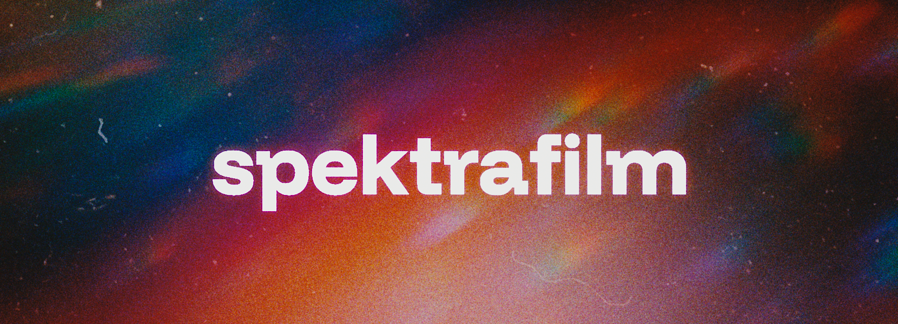

# Spectral film simulations of analog photography

> [!IMPORTANT]
> At this stage, this project is very experimental and a work in progress. Things might change fast, and it is really just a playground for exploring the simulation model.


An exploration of how to make good use of spectroscopic data from manufacturer datasheets in an end-to-end, physically based model with spectral calculations, with the goal of turning that data into convincing film, print, and scan renderings that can be explored interactively.

An high-level writeup and discussion on this project is avalable on [discuss.pixls.us](https://discuss.pixls.us/t/spectral-film-simulations-from-scratch/48209).

In practice, spektrafilm is both a research playground and a half usable experimentation tool (maybe fully usable in the near future when it will stabilize and be gpu accellerated :)). It lets you start from a camera image, pass it through a virtual negative, print, and scan pipeline, and inspect how film-stock data, couplers, enlarger settings, grain, halation, and other photographic effects shape the final result. The aim is not just to imitate a generic "film look," but to build a model that stays connected to the structure and behaviour of real photographic materials.


The desktop GUI makes that workflow accessible without writing code, letting you import RAW files or prepared linear images, explore different film and paper profiles, adjust the simulation interactively, and move quickly between fast(-ish) previews and more detailed final scans.

## Introduction

The simulation emulates negative or positive film emulsions starting from published data for film stocks. An example of the curves for Kodak Portra 400 (data-sheet e4050, 2016) is shown in the following figure (note that the CMY diffuse densities are generic because they are usually not published).


An example of data for Kodak Portra Endura print paper (data-sheet e4021, 2009) is shown in the next figure.


The left panel shows the spectral log sensitivities of each color layer. The central panel shows the log-exposure-density characteristic curves for each layer when the medium is exposed to a neutral gray gradient under a reference light. The panel on the right shows the absorption spectra of the dyes formed on the medium during chemical development. 'Min' and 'Mid' are the absorption values for the unexposed processed medium and a neutral gray "middle" exposure, respectively.

Starting from linear RGB data from a camera RAW file, the simulation reconstructs the spectral data, projects the virtual light transmitted through the negative onto print paper, and uses a simplified color enlarger with dichroic filters to balance the print. Finally, it scans the virtual print using the light reflected from the print.

The pipeline is sketched in this figure, adapted from [^1]:

Here, light from a scene (a RAW file from your camera) is exposed onto a virtual negative with specific spectral sensitivities, then a chemical process creates the dye densities using density curves and more complex interactions that model the couplers. The virtual negative is projected with a specific illuminant onto paper that is developed again with simple density curves and no couplers in this case. Print paper is already designed to reduce channel cross-talk, since it does not need to sample a scene, only the dyes on the negative.

The pipeline allows many characteristics to be added in a physically sound way. For example:

- halation
- film grain generated on the negative (using a stochastic model)
- pre-flashing of the print to retain highlights

From my experience experimenting with film simulation, data-sheet curves are really not enough to reproduce a decent film look. The key is to understand that film emulsions contain couplers, chemicals that are produced during development alongside the actual CMY dyes, and these are very important for achieving the desired saturation. The main ones are:

- masking couplers, which give the typical orange color to unexposed developed film. These couplers are consumed locally where density is formed and are used to reduce the effect of cross-talk in layer absorption, thus increasing saturation.
The presence of masking couplers is simulated with a negative absorption contribution in the isolated dye absorption spectra. See, for example, data for Portra 400 updated to include the masking couplers and with unmixed print density characteristic curves:


- direct inhibitor couplers, which are released locally when density is formed and inhibit the formation of density in nearby layers or in the same layer. This increases saturation and contrast. Also, if we let the couplers diffuse in space, they can increase local contrast and perceived sharpness.

A more detailed description of colour couplers can be found in Chapter 15 of Hunt's book [^2].

## Package layout

The codebase is organized as three packages under [src/spektrafilm](src/spektrafilm), [src/spektrafilm_gui](src/spektrafilm_gui), and [src/spektrafilm_profile_creator](src/spektrafilm_profile_creator):

1. [src/spektrafilm](src/spektrafilm): runtime simulation pipeline and processed profile consumption.
2. [src/spektrafilm_gui](src/spektrafilm_gui): desktop GUI built on top of the runtime package.
3. [src/spektrafilm_profile_creator](src/spektrafilm_profile_creator): raw-curve processing and profile generation/fitting workflows.

Canonical import surfaces:

1. Runtime API: [src/spektrafilm/runtime/api.py](src/spektrafilm/runtime/api.py).
2. GUI entry point: [src/spektrafilm_gui/app.py](src/spektrafilm_gui/app.py).

Minimal runtime API:

```python
from spektrafilm import create_params, simulate

params = create_params(
	film_profile="kodak_portra_400",
	print_profile="kodak_portra_endura",
)
result = simulate(image, params)
```

Dependency direction:

1. `spektrafilm_gui` depends on `spektrafilm`.
2. `spektrafilm_profile_creator` depends on `spektrafilm`.
3. `spektrafilm` does not depend on either higher-level package.

## Installation

### Using `uv`

You can easily run the latest version of spektrafilm directly from the Git repository
using [uv](https://docs.astral.sh/uv/):

```bash
uvx --from git+https://github.com/andreavolpato/spektrafilm.git spektrafilm
```

Or from a local working copy:
```bash
uvx path/to/local/working_copy
```

#### Installing uv

Under Windows you can install `uv` using the following command, which you only need to execute once:
```bash
# ! you only need to exeucte this command the first time to install uv!
powershell -ExecutionPolicy ByPass -c "irm https://astral.sh/uv/install.ps1 | iex"
```
Instructions for macOS and Linux are [here](https://docs.astral.sh/uv/getting-started/installation/#standalone-installer).


### Using `pip`

You can also use `pip` normally:
```bash
# install:
git clone https://github.com/andreavolpato/spektrafilm.git
cd spektrafilm
pip install -e .

# run
spektrafilm
```
but I recommend creating a clean virtual environment to install the dependencies, for example by using `conda`.

#### Using `conda`
From a terminal:

```bash
conda create -n spektrafilm python=3.13
conda activate spektrafilm
```

Install the package `spektrafilm` by going to the repository folder and running:

```bash
pip install -e .
```
Launch the GUI:

```bash
spektrafilm
```
To remove the environment:
```bash
conda env remove -n spektrafilm
```

## Testing

Run the test suite with:

```bash
python -m pytest tests -v
```

Regression snapshots are stored as committed `.npz` files in `tests/baselines/` and are checked by `tests/test_regression_baselines.py`.
When a simulation change is intentional, regenerate snapshots manually:

```bash
python scripts/regenerate_test_baselines.py
```

Snapshot files are never updated automatically during pytest runs.

## GUI
When launching the GUI, a `napari` window should appear. Note that `napari` is not color-managed. The way I work is to set the screen and operating system color profile to sRGB, and I set the output color space of the simulation to sRGB. On Windows, the GUI will try to get the display profile and convert the final image for viewing; if successful, this will be indicated in the status bar.

You can import camera RAW files directly from the `import raw` section. Choose the white balance mode (`as shot`, `daylight`, `tungsten`, or `custom`), set temperature and tint when using `custom`, then click `select file`. The RAW importer uses `rawpy` and converts the image to the current `input color space` and `apply CCTF decoding` settings. You can use `reprocess raw` to reload the same file and reprocess it with the new settings.

> [!TIP]
> Hover over the widgets and controls to see a helpful tooltip.

You can still load externally prepared linear images through the `file loader`. This is useful if you want a fully manual raw-development workflow or if you prefer preprocessing in another tool. For best results, keep the image scene-referred and linear, ideally as a 16-bit or 32-bit float TIFF/EXR in a wide-gamut color space such as linear Rec2020 or linear ProPhoto RGB.

> [!IMPORTANT]
> The `file loader` imports 16-bit and 32-bit image files as new layers using OpenImageIo. PNG, TIFF, and EXR are known to work, and other formats may work too.

Please bear in mind that this is a highly experimental project, and many controls are exposed in the GUI with little or no documentation. Use the tooltips by hovering over the controls, or explore the code.
Adjust `exposure_compensation_ev` to change the exposure of the negative. You can visualize a virtual scan of the negative by pressing `scan_film` and `PREVIEW/SCAN`.

For fine-tuning halation, adjust `scattering size`, `scattering strength`, `halation size`, and `halation strength`. There are three controls for each, defining the effect on the three color channels (RGB). `scattering size` and `halation size` represent the sigma value for Gaussian blurring. `scattering strength` and `halation strength` refer to the percentage of scattered or halated light.
`y filter shift` and `m filter shift` are the controls for the virtual yellow and magenta filters of the color enlarger. They are the number of steps shifted from a neutral position, that is, the starting settings that make an 18% gray target photographed with the correct reference illuminant fully neutral in the final print.

There are controls to apply lens blur at several stages of the pipeline, for example in the camera lens, the color enlarger lens, or the scanner. There is also a control for blurring density to simulate diffusion during development, `grain > blur`. The scanner also has sharpness controls via a simple unsharp mask filter.

For example, magnifying the film to a 0.7 x 0.7 mm crop reveals the isolated dye clouds.


This is one of the most appealing aspects for me, especially when I think of printing large, high-resolution simulated images while retaining all this low-level grain detail that is not present in the original picture.

## Preparing input images manually with darktable

Direct RAW import in the GUI is the simplest workflow, but manual development is still useful when you want tighter control over the input rendering.

The simulation expects linear scene-referred files as input, with or without a transfer function. I usually open RAW files from digital cameras with [darktable](https://www.darktable.org/), deactivate the non-linear mappings done by `filmic` or `sigmoid`, and adjust the exposure to preserve all the information while avoiding clipping. Then I export the file as a 32-bit float TIFF in linear ProPhoto RGB.

## Example usage of the GUI

[Watch the GUI demo video](https://github.com/user-attachments/assets/5f16aba6-3f59-41a2-a9d1-6ffa4d1c939c)

Thank you to Adam Severeid from the [discuss.pixls.us](https://discuss.pixls.us/) forum, [Have a seat, we’ve been waiting for you. - discuss.pixls.us](https://discuss.pixls.us/t/have-a-seat-weve-been-waiting-for-you/44814), for providing the RAW file I used here in a Play Raw post.

## Things to consider

- The simulation is quite slow for full-resolution images. On my laptop it takes roughly 10 seconds to process 6 MP images. I usually adjust most values with `PREVIEW`. When a final image is needed, use `SCAN`, which bypasses image scaling.
- Based on my experience building the profiles, Fujifilm data are less self-consistent than Kodak data.

## References

[^1]: Giorgianni, Madden, Digital Color Management, 2nd edition, 2008 Wiley
[^2]: Hung, The Reproduction of Color, 6th edition, 2004 Wiley
[^3]: Mallett, Yuksel, Spectral Primary Decomposition for Rendering with sRGB Reflectance, Eurographics Symposium on Rendering - DL-only and Industry Track, 2019, doi:10.2312/SR.20191216

Sample images are from [signatureedits.com](https://www.signatureedits.com/)/free-raw-photos.


